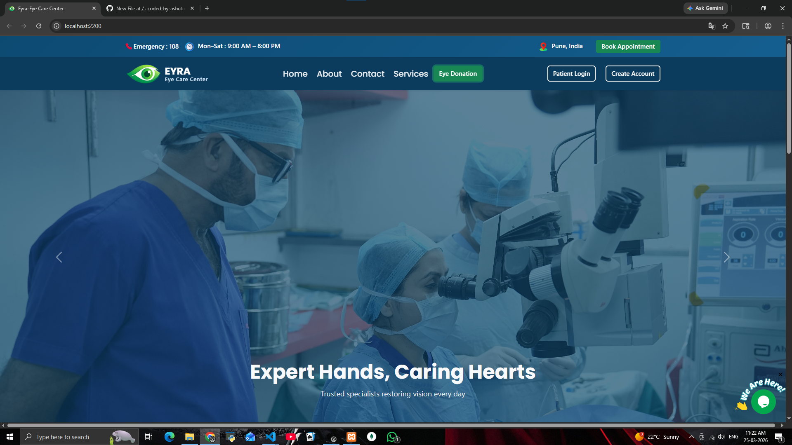
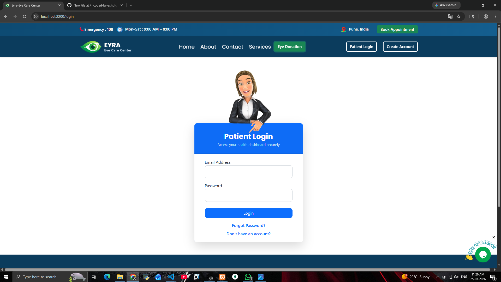

🏥 Eye Hospital Management System

A full-stack web application designed to manage hospital operations such as patient registration, appointment booking, and administrative control efficiently.
This project includes a real-time chat feature using Tawk.to, allowing users to communicate instantly with support/admin for queries and assistance.

🚀 Features
👤 Patient Registration & Login System
🔐 Secure Authentication
📅 Book Appointments with Doctors
🧑‍⚕️ Doctor & Patient Management
🛠️ Admin Dashboard
📊 View & Manage Appointments
📁 Dynamic Data Handling
💬 Real-time Chat Support (Tawk.to Integration) ⭐

Frontend:

HTML
CSS
Bootstrap
EJS (Embedded JavaScript Templates)

Backend:

Node.js
Express.js

Database:

MySQL 

📂 Project Structure
Eye_Clinic/
│
├── views/              # EJS templates
├── routes/             # Backend routes
├── public/             # Static files (CSS, JS, Images)
├── screenshots/        # Project screenshots 
├── package.json        # Dependencies
└── README.md
⚙️ Installation & Setup
Clone the repository
git clone https://github.com/coded-by-ashutosh/eye-hospital-management-system.git
Navigate to project folder
cd eye-hospital-management-system
Install dependencies
npm install
Start the server
npm start
Open in browser:
http://localhost:2200

📸 Screenshots

🎯 Future Improvements
🔔 Email Notifications for Appointments
📱 Mobile Responsive Enhancements
💳 Online Payment Integration
📊 Advanced Analytics Dashboard
👨‍💻 Author

Ashutosh
GitHub: https://github.com/coded-by-ashutosh

⭐ Support

If you like this project, please ⭐ the repository and share it!
