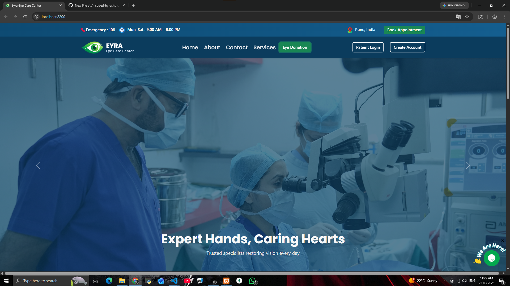
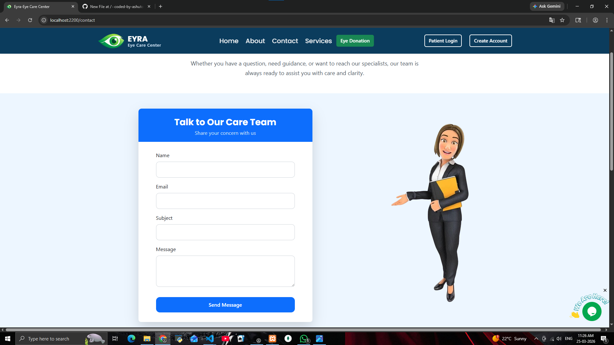
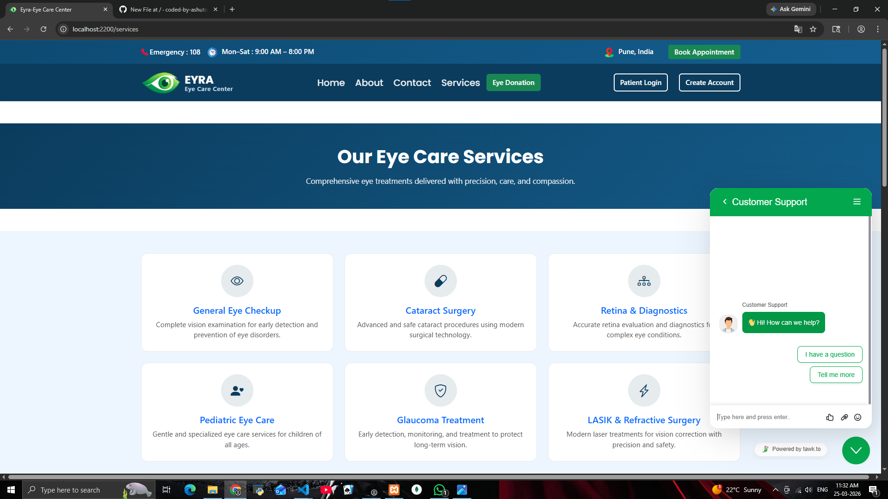
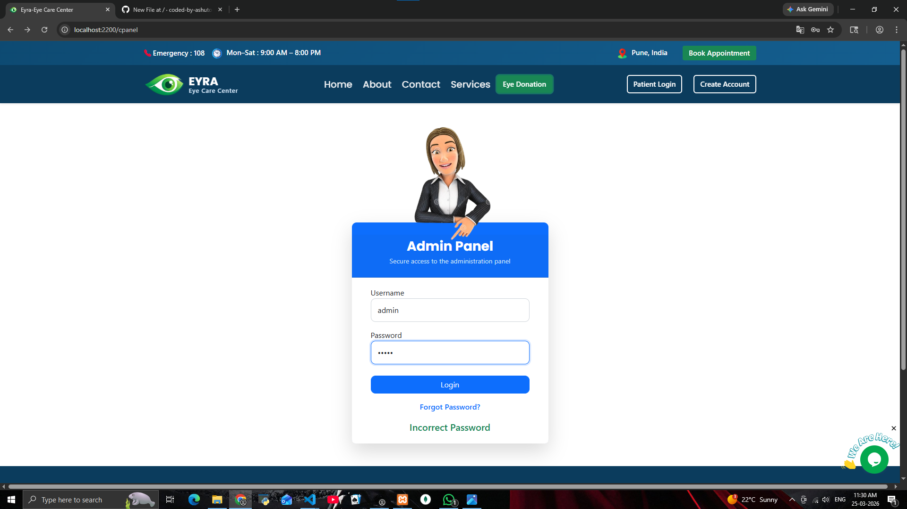
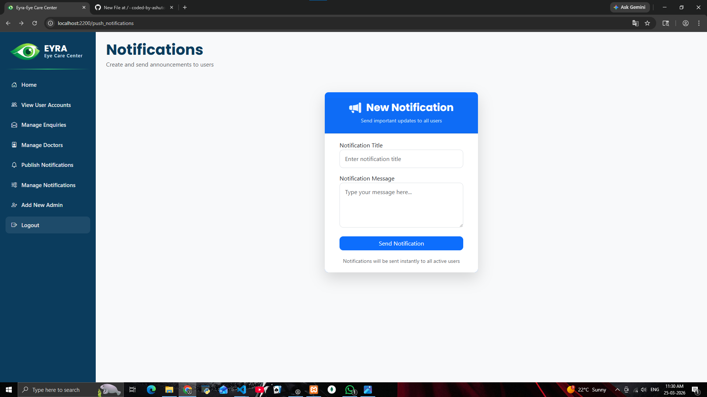
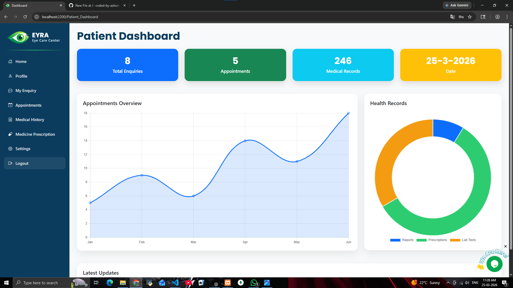
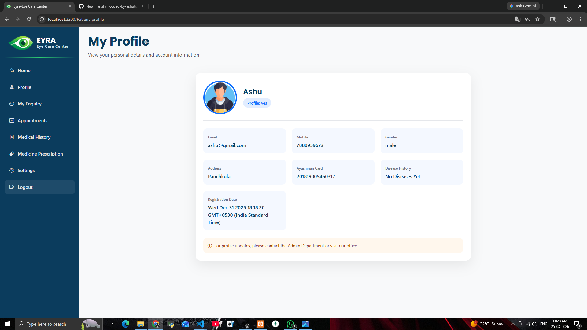
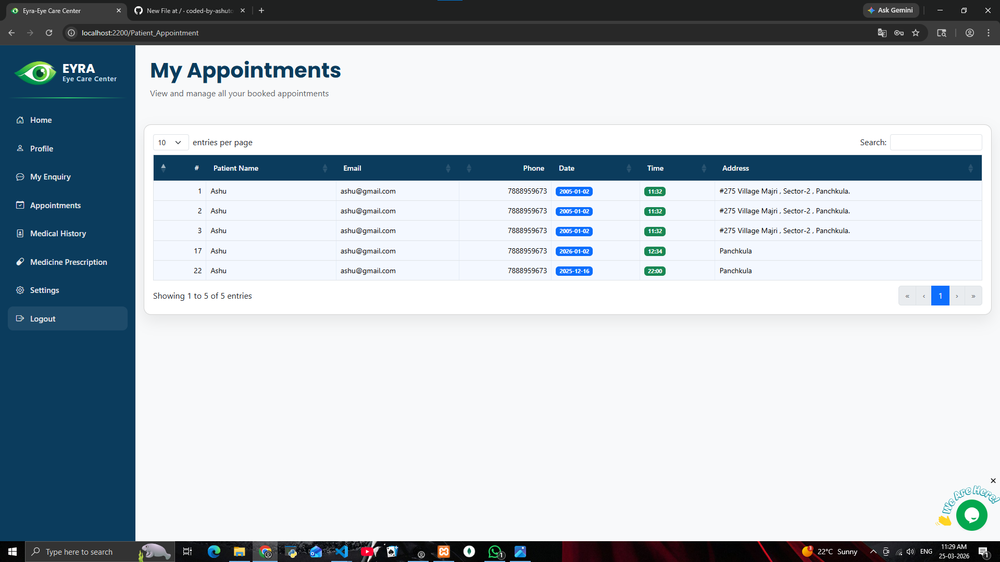
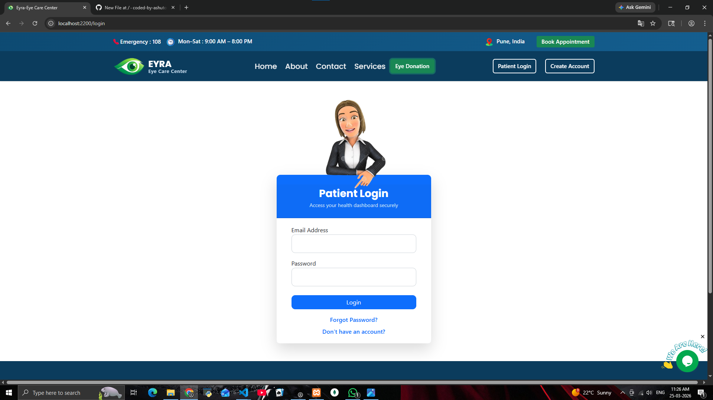
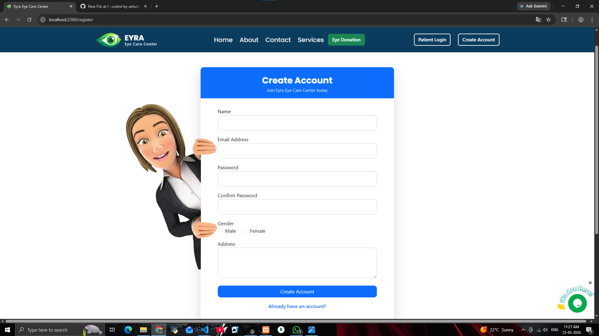

🏥 Eye Hospital Management System

A full-stack web application designed to manage hospital operations such as patient registration, appointment booking, and administrative control efficiently.
This project includes a real-time chat feature using Tawk.to, allowing users to communicate instantly with support/admin for queries and assistance.

🚀 Features

👤 Patient Registration & Login System
🔐 Secure Authentication
📅 Book Appointments with Doctors
🧑‍⚕️ Doctor & Patient Management
🛠️ Admin Dashboard
📊 View & Manage Appointments
📁 Dynamic Data Handling
💬 Real-time Chat Support (Tawk.to Integration) ⭐

Frontend:

HTML
CSS
Bootstrap
EJS (Embedded JavaScript Templates)

Backend:

Node.js
Express.js

Database:

MySQL 

📂 Project Structure

Eye_Clinic/
│
├── views/              # EJS templates
├── routes/             # Backend routes
├── public/             # Static files (CSS, JS, Images)
├── screenshots/        # Project screenshots 
├── package.json        # Dependencies
└── README.md

⚙️ Installation & Setup

1. Clone the repository
   * git clone https://github.com/coded-by-ashutosh/eye-hospital-management-system.git
2. Navigate to project folder
   * cd eye-hospital-management-system
3. Install dependencies
   * npm install
4. Start the server
   * npm start
5. Open in browser:
   * http://localhost:2200

🗄️ Database Setup

1. Make sure MySQL is running (XAMPP recommended)

2. Import the database file:

   * Open **phpMyAdmin** or **MySQL Workbench**
   * Import the file:
     `Database/database.sql`

   *(This will automatically create and select the database `eyra`)*

3. Default Admin Login:

   * Username: `admin`
   * Password: `123456`

4. Configure your database connection in the project:

   * Host: `localhost`
   * User: `root`
   * Password: *(leave blank if using XAMPP)*
   * Database: `eyra`

---

⚠️ Notes

* Ensure MySQL is running before starting the project
* If database already exists, delete it and re-import the SQL file
* No manual database creation is required

📸 Screenshots

🎯 Future Improvements

🔔 Email Notifications for Appointments
📱 Mobile Responsive Enhancements
💳 Online Payment Integration
📊 Advanced Analytics Dashboard
👨‍💻 Author

Ashutosh
GitHub: https://github.com/coded-by-ashutosh

⭐ Support

If you like this project, please ⭐ the repository and share it!
