# 🏥 EYRA – Eye Hospital Management System

EYRA is a full-stack Eye Hospital Management System designed to simplify and manage important hospital operations such as patient registration, appointment booking, doctor consultation, prescription management, patient notifications, eye donation requests, and administrative control.

The application provides separate dashboards and workflows for **Patients, Doctors, and Administrators**. It also includes responsive layouts for desktop and mobile devices.

---

## 🚀 Key Features

### 👤 Patient Module

* Patient registration and secure login
* Profile completion workflow
* Protected dashboard access
* Book appointments with doctors
* View appointment status and details
* View and download prescriptions
* Medical and treatment history
* View doctor-assigned treatment information
* Receive prescription and hospital notifications
* Archive notifications
* Submit contact enquiries
* Change account password
* View personal profile information
* Real-time chat support using Tawk.to

### 🧑‍⚕️ Doctor Module

* Secure doctor login
* Doctor dashboard with appointment analytics
* View assigned appointments
* View complete patient appointment details
* Mark appointments as visited
* Write prescriptions for patients
* Add symptoms, diagnosis, medicines, advice, and next-visit dates
* Automatically mark appointments as **Completed** after saving a prescription
* View prescription history
* View generated prescriptions
* Download prescriptions as PDF
* View assigned patients
* View detailed patient profiles
* View consultation summaries
* Manage doctor profile and account settings

### 🛠️ Admin Module

* Secure admin login
* Admin dashboard with hospital analytics
* Manage patient accounts
* View detailed patient profiles
* Manage doctors
* Add, edit, delete, block, and unblock doctors
* Upload doctor photos and signatures
* Manage appointments
* Approve and reject appointments
* Assign doctors to appointments
* View complete appointment details
* Manage patient enquiries
* Reply to patient enquiries
* Delete enquiries
* Publish hospital notifications
* Manage and delete notifications
* Manage eye donation requests
* Approve, reject, and delete eye donation requests

### 📋 Appointment and Prescription Workflow

```text
Patient Books Appointment
            ↓
Admin Reviews Appointment
            ↓
Admin Assigns Doctor
            ↓
Appointment Status: Approved
            ↓
Doctor Marks Patient as Visited
            ↓
Appointment Status: Visited
            ↓
Doctor Writes Prescription
            ↓
Appointment Status: Completed
            ↓
Patient Receives Notification
            ↓
Patient Views or Downloads Prescription
```

### 📱 Responsive Design

* Responsive desktop layout
* Mobile-friendly navigation
* Responsive patient dashboard
* Responsive appointment pages
* Responsive services page
* Mobile-friendly prescription view
* Bootstrap-based responsive components

---

## 🧰 Technologies Used

### Frontend

* HTML5
* CSS3
* Bootstrap 5
* JavaScript
* EJS – Embedded JavaScript Templates
* Bootstrap Icons
* jQuery
* DataTables

### Backend

* Node.js
* Express.js
* REST-style routing
* MVC Architecture
* Express Session

### Database

* MySQL
* MySQL2
* phpMyAdmin

### Packages and Tools

* bcryptjs
* Multer
* Express Session
* Body Parser
* html2pdf.js
* Nodemon
* Git
* GitHub
* XAMPP

---

## 📂 Project Structure

```text
Eyra/
│
├── Controller/
│   ├── AdminController.js
│   ├── AppointmentController.js
│   ├── AuthenticateController.js
│   ├── ContactController.js
│   ├── DoctorController.js
│   └── EyeDonationController.js
│
├── Database/
│   ├── database.sql
│   └── myconnect.js
│
├── Modal/
│   ├── Admin.js
│   ├── Appointment.js
│   ├── Doctor.js
│   ├── EyeDonation.js
│   ├── Notification.js
│   ├── PatientNotification.js
│   ├── Prescription.js
│   └── useraccount.js
│
├── public/
│   ├── css/
│   ├── js/
│   ├── images/
│   ├── icons/
│   ├── Doctors_Photo/
│   ├── Doctors_Signature/
│   └── Patients_Photo/
│
├── screenshots/
│   ├── desktop/
│   └── mobile/
│
├── views/
│   ├── Admin/
│   ├── Appointment_Form/
│   ├── Doctor/
│   ├── Footer/
│   ├── Header/
│   ├── CDN/
│   └── chat/
│
├── main.js
├── route.js
├── package.json
├── package-lock.json
├── .gitignore
└── README.md
```

---

## ⚙️ Installation and Setup

### 1. Clone the Repository

```bash
git clone https://github.com/coded-by-ashutosh/eye-hospital-management-system.git
```

### 2. Navigate to the Project Folder

```bash
cd eye-hospital-management-system
```

### 3. Install Dependencies

```bash
npm install
```

### 4. Configure the Database

Make sure **MySQL is running** through XAMPP.

Open **phpMyAdmin** and import:

```text
Database/database.sql
```

The SQL file contains the required database structure and project data.

### 5. Configure the Database Connection

Open:

```text
Database/myconnect.js
```

Configure the database connection according to your local MySQL setup.

Example:

```javascript
const mysql = require("mysql2");

const db = mysql.createConnection({
    host: "localhost",
    user: "root",
    password: "",
    database: "eyra"
});

module.exports = db;
```

> If you use XAMPP with the default MySQL configuration, the password is usually empty.

### 6. Start the Application

```bash
npm start
```

If Nodemon is configured:

```bash
npm run dev
```

### 7. Open the Application

Open the following address in your browser:

```text
http://localhost:2200
```

---

## 🔐 Default Login Credentials

### Admin

```text
Username: admin
Password: Admin@Eyra
```

Doctor and patient accounts can be created or managed through the application.

> For security, change the default admin password before deploying the project publicly.

---

# 📸 Application Screenshots

## 🖥️ Desktop View

### 🏠 Home Page

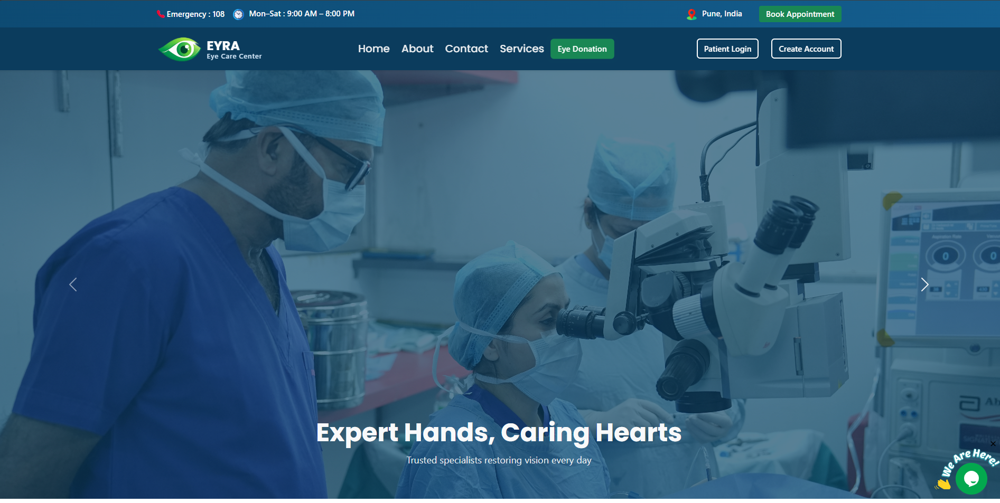

### 👤 Patient Dashboard

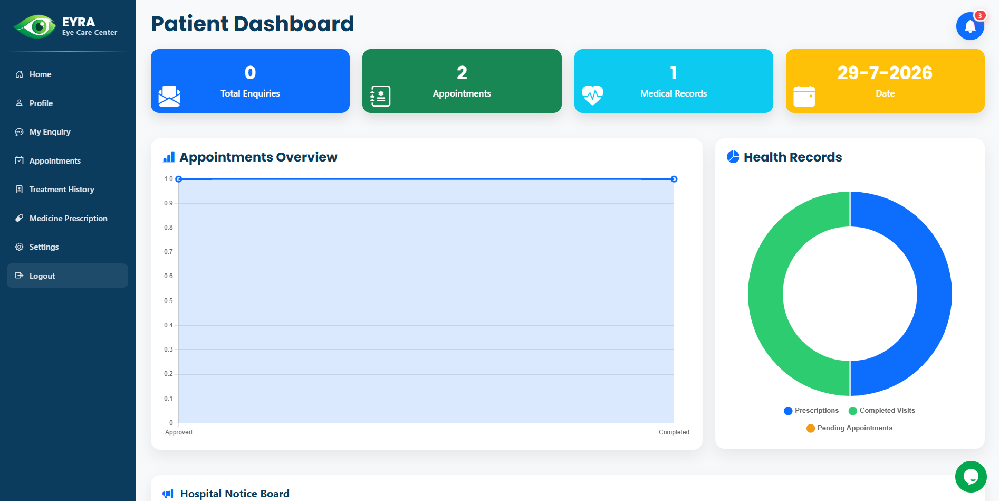

### 💬 Real-Time Chat Support

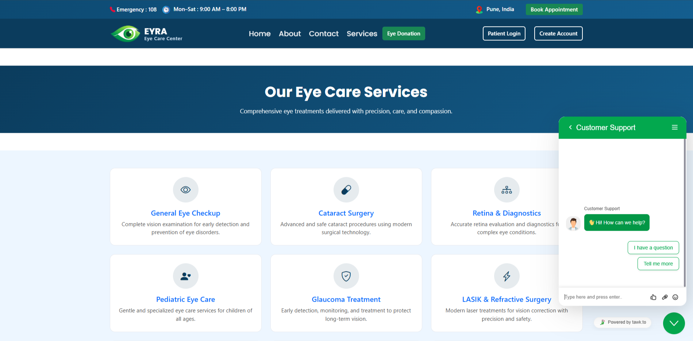

### 📅 Book Appointment

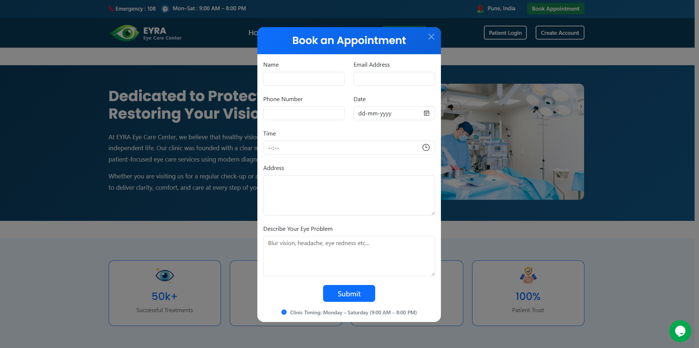

### 🛠️ Admin Dashboard

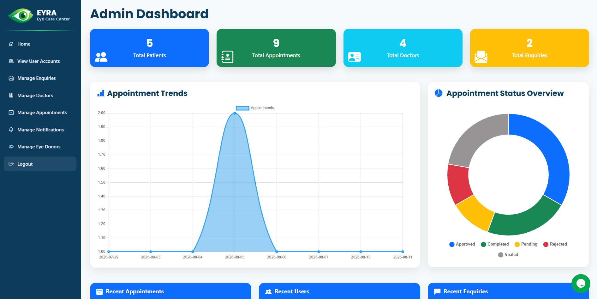

### 🧑‍⚕️ Manage Doctors

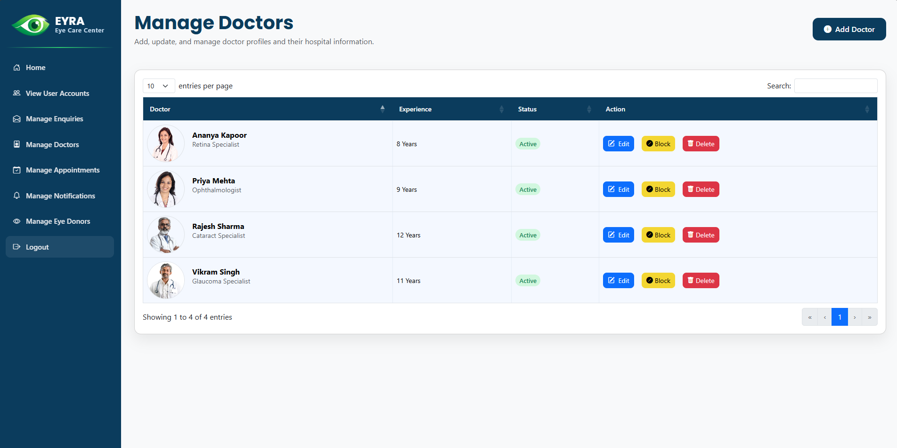

### 📋 Manage Appointments

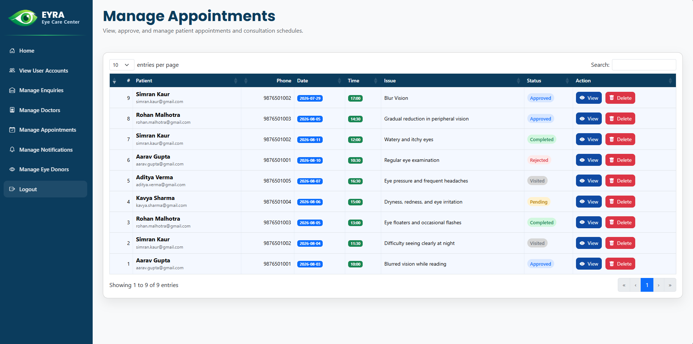

### 👨‍⚕️ Doctor Dashboard

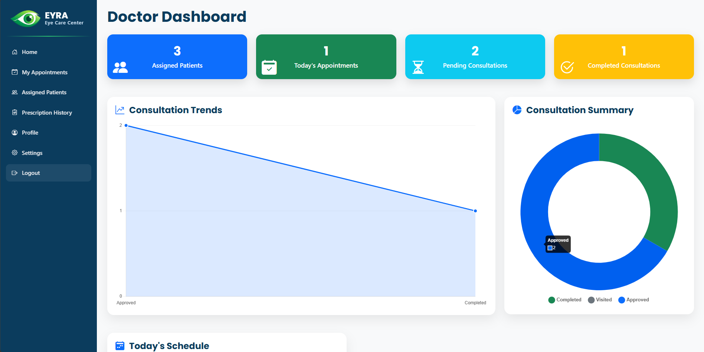

### 👥 Assigned Patients

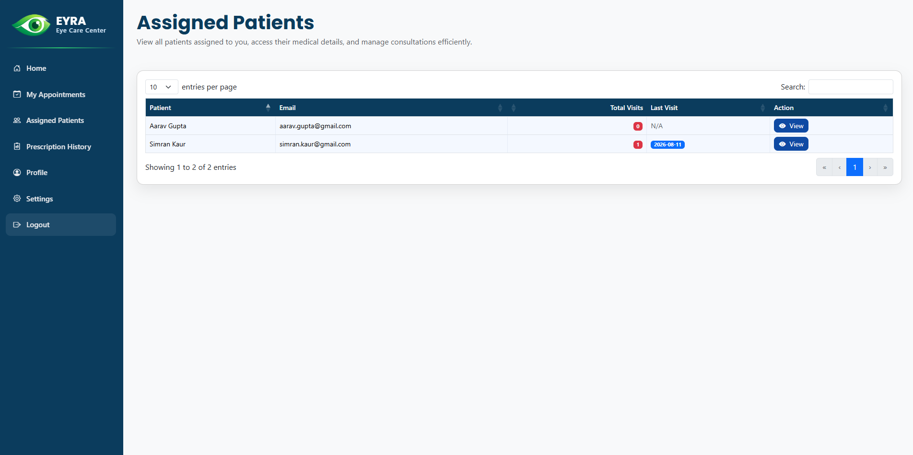

### 🩺 Assigned Patient Profile

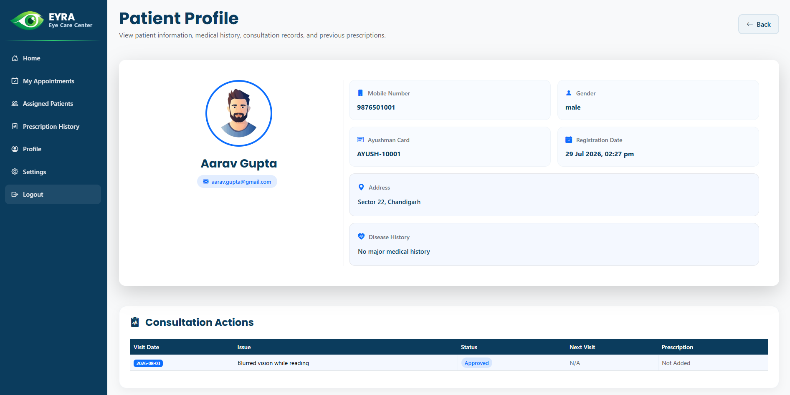

### 📝 Write Prescription

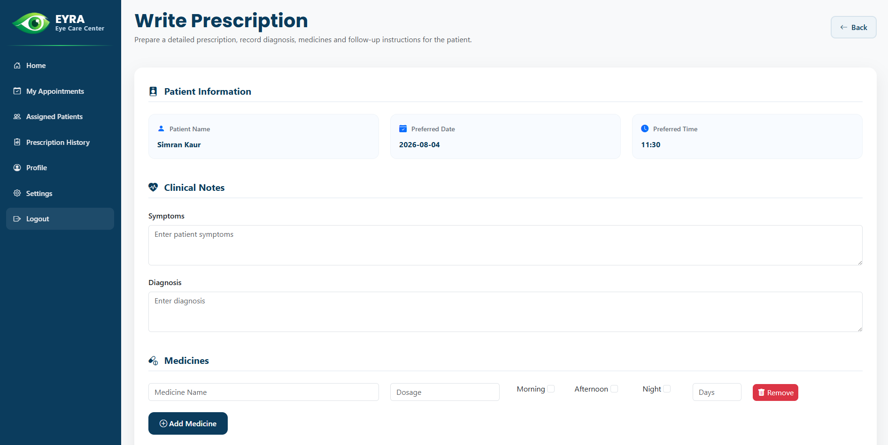

### 📄 Generated Prescription

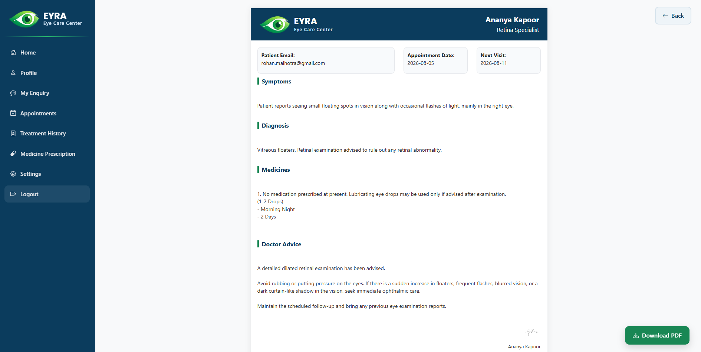

---

## 📱 Mobile Responsive View

### 🏠 Mobile Home Page


### 🩺 Mobile Services Page

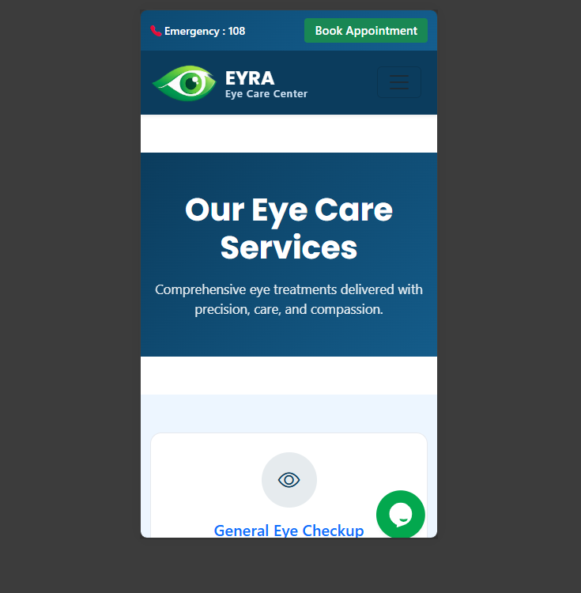

### 📅 Mobile Book Appointment

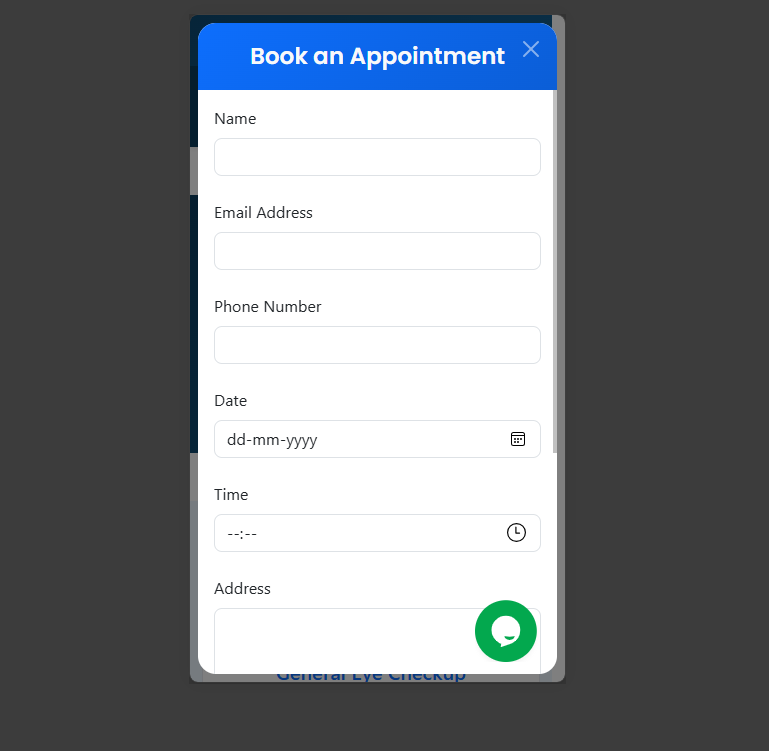

### 👤 Mobile Patient Dashboard

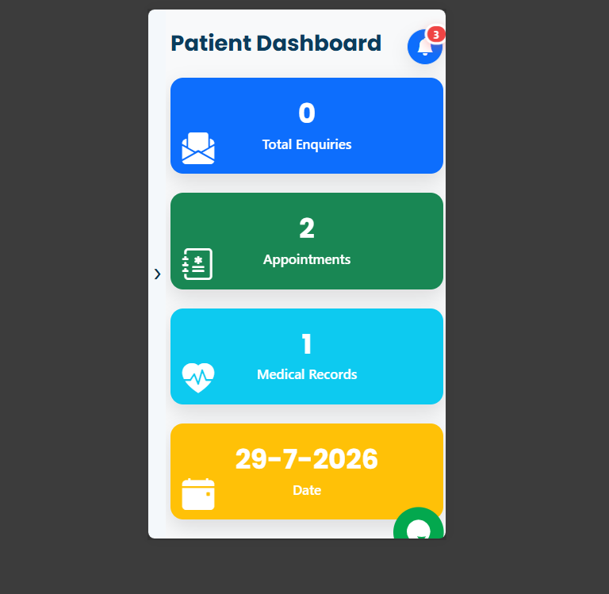

### 📄 Mobile Prescription

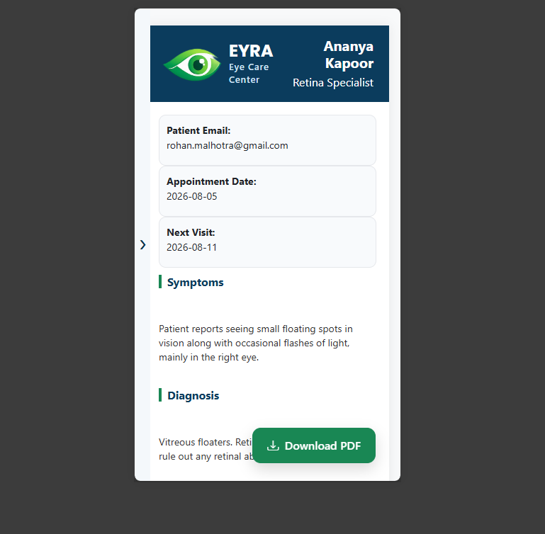

---

## 🗄️ Database Information

The complete database file is available at:

```text
Database/database.sql
```

Import this file using **phpMyAdmin** before running the application.

---

## ⚠️ Important Notes

* Make sure MySQL is running before starting the application.
* Install all Node.js dependencies using `npm install`.
* Do not upload `node_modules` to GitHub.
* Keep database credentials private before deploying the application.
* Update the default admin password before using the project in production.
* Uploaded patient photos, doctor photos, and doctor signatures are stored inside the `public` directory.
* The project uses session-based authentication for Patients, Doctors, and Administrators.
* Patient dashboard access is restricted until the patient completes the required profile information.

---

## 👨‍💻 Developer

**Ashutosh**

Full Stack Developer

GitHub: https://github.com/coded-by-ashutosh

---

## ⭐ Support

If you found this project useful, consider giving the repository a **star** on GitHub.
